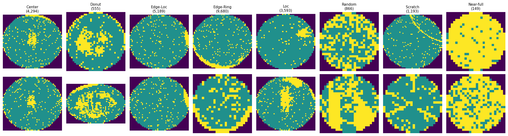
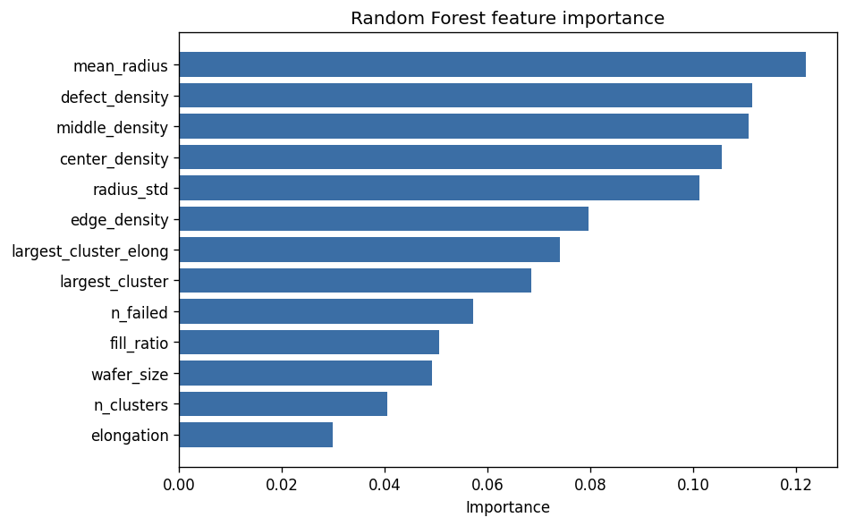
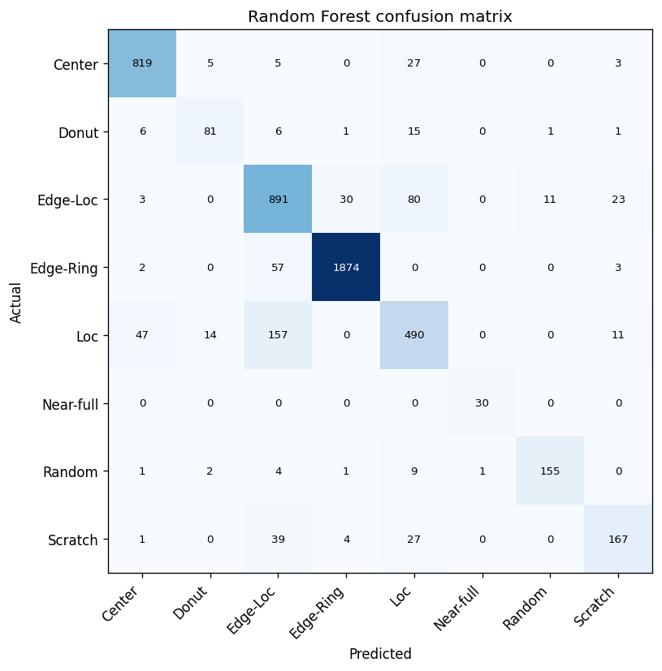
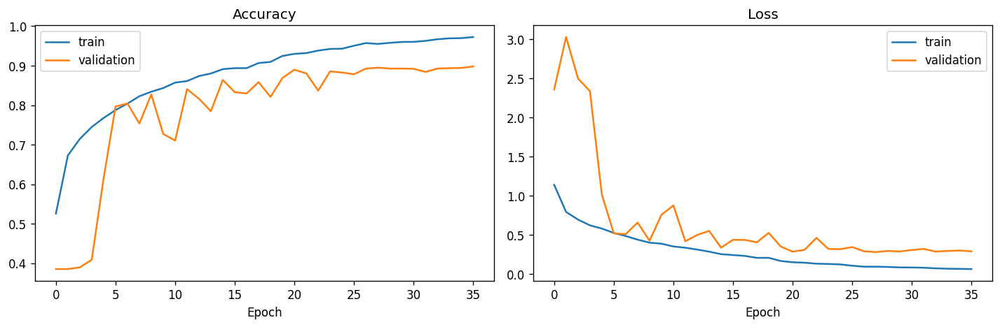

# Wafer Defect Classification and Automated Excursion Reporting

Classifies semiconductor wafer failure patterns from real production data, compares
hand-engineered spatial features against a convolutional neural network, and generates
engineering excursion notes for flagged wafers.

**Dataset:** WM-811K (Wu, Jang & Chen) — 811,457 wafer maps from real fab production.

---

## Results

| | Accuracy | Macro-F1 |
|---|---|---|
| Random Forest — 13 engineered features | 88.3% | **0.856** |
| CNN — 64×64×3 images, ~103k parameters | **88.9%** | 0.842 |

Evaluated on 5,104 held-out wafers. Both models tested on the identical split.

**The engineered-feature model wins on macro-F1.** The CNN's higher raw accuracy comes
from performing better on the large common classes; averaged evenly across all eight
defect types, thirteen hand-designed measurements beat a neural network learning from
raw pixels.

### Per-class F1

| Class | Test n | Random Forest | CNN | Better |
|---|---|---|---|---|
| Edge-Ring | 1,936 | 0.975 | **0.980** | tie |
| Center | 859 | **0.942** | 0.888 | RF |
| Random | 173 | **0.912** | 0.881 | RF |
| Edge-Loc | 1,038 | 0.811 | **0.873** | CNN |
| Scratch | 238 | 0.749 | **0.798** | CNN |
| Donut | 111 | 0.761 | **0.783** | CNN |
| Loc | 719 | 0.717 | 0.716 | tie |
| Near-full | 30 | **0.984** | 0.817 | **RF** |

Two patterns worth naming:

**Engineered features win on rare classes.** Near-full has 149 examples in the entire
dataset. The Random Forest scores 0.984 because `largest_cluster` encodes the rule
directly — one solid blob covering nearly the whole wafer. The CNN reached 0.967 recall
but only 0.707 precision; with 149 examples it could not learn a reliable boundary. A
hand-designed feature does not need thousands of examples to work.

**Learned features win on visually complex patterns.** The CNN beats the Random Forest on
Scratch and Edge-Loc, where the distinguishing information is spatial nuance that summary
statistics flatten. Convolution is genuinely good at finding thin lines.

---

## The data, honestly

| Count | What |
|---|---|
| 811,457 | Total wafer maps |
| 172,950 | Carry a human-written label — 21.3% |
| 147,431 | Of those are labelled `none` — a normal wafer |
| **25,519** | **Show an actual defect pattern — the real working set, 3% of the headline** |

Within the defect classes the imbalance is 65:1.

| Class | Count |
|---|---|
| Edge-Ring | 9,680 |
| Edge-Loc | 5,189 |
| Center | 4,294 |
| Loc | 3,593 |
| Scratch | 1,193 |
| Random | 866 |
| Donut | 555 |
| Near-full | 149 |



*Two examples of each defect class, with counts. Purple is off-wafer, teal is a passing die, yellow is a failing die.*

**Why this drives every decision in the project.** 85% of labelled wafers are normal. A
model that ignores the image and always guesses "normal" scores 85% accuracy while
detecting zero defects. Every result here is therefore reported as macro-F1 and per-class
recall, never overall accuracy alone. Class weighting was applied to both models
(Near-full weight 21.49 against Edge-Ring 0.33).

The dataset also contains 329 distinct wafer dimensions, from 22 to 212 dies across,
median 39. Engineered features are dimension-independent by construction; CNN inputs were
resized to 64×64 preserving aspect ratio, with the wafer centred and padded rather than
stretched.

---

## Engineered features

Thirteen measurements per wafer, each describing the failure pattern the way an engineer
would read it.

| Feature | Captures |
|---|---|
| `defect_density` | Fraction of dies that failed |
| `center_density`, `middle_density`, `edge_density` | Where the failures sit — wafer split into three concentric rings |
| `mean_radius` | Average distance of failures from wafer centre |
| `radius_std` | Whether failures sit at one consistent radius (a ring) or spread across many |
| `n_clusters`, `largest_cluster` | Whether failures form one solid blob or scattered specks |
| `elongation`, `largest_cluster_elong` | How stretched the failure region is — covariance eigenvalue ratio |
| `fill_ratio` | How much of its bounding box the largest blob occupies |
| `n_failed`, `wafer_size` | Raw scale |

### Measured importance

```
mean_radius            0.1218
defect_density         0.1114
middle_density         0.1107
center_density         0.1056
radius_std             0.1012
edge_density           0.0796
largest_cluster_elong  0.0740
largest_cluster        0.0684
n_failed               0.0572
fill_ratio             0.0505
wafer_size             0.0492
n_clusters             0.0405
elongation             0.0298
```



No single feature dominates — the top six sit between 0.079 and 0.122. Spatial location
carries most of the weight, spread evenly, which indicates the model has not found a
shortcut.

---

## Diagnosing and fixing the Scratch class

The first model used ten features and scored 88.3%… on paper. Per-class recall told a
different story:

| | 10 features | 13 features |
|---|---|---|
| Accuracy | 85.3% | **88.3%** |
| Macro-F1 | 0.802 | **0.856** |
| **Scratch recall** | **0.315** | **0.702** |
| Scratch precision | 0.630 | 0.803 |
| Scratch F1 | 0.420 | 0.749 |

Under a third of scratches were being found. The confusion matrix showed where they went:
of 238 real scratches, 96 were classified as Loc and 55 as Edge-Loc.

**The cause was a gap in the feature design, not a training problem.** A scratch is a thin
line. The original ten features measured *how much* failed and *where* it failed — nothing
measured *shape*. To the model, a thin scratch and a compact blob at the same radius with
the same density were indistinguishable.

Three shape features were added. Measured separation across 200 wafers per class:

| | cluster elongation | fill ratio |
|---|---|---|
| Scratch | **0.861** | **0.456** |
| Loc | 0.601 | 0.573 |

Scratch recall more than doubled. Precision rose alongside it, confirming the model
learned the distinction rather than simply guessing Scratch more often.



One note on interpretation: `largest_cluster_elong` ranks only 7th in feature importance
despite driving this improvement. Importance measures average contribution across all
25,519 wafers, and Scratch is under 5% of them. **Feature importance would never have
surfaced this gap** — it was found by reading a confusion matrix and reasoning about what
the existing measurements could not see.

---

## CNN

```
Input 64×64×3  (background / passing die / failing die as separate channels)
Conv2D 32 → BatchNorm → MaxPool
Conv2D 64 → BatchNorm → MaxPool
Conv2D 128 → BatchNorm → GlobalAveragePooling
Dropout 0.3 → Dense 64 → Dense 8 softmax
```

~103,000 parameters against 16,332 training images — roughly six images per parameter,
small enough to force pattern learning rather than memorisation. Trained with class
weighting, early stopping on validation loss, and learning-rate reduction on plateau.
Stopped at epoch 36; best weights restored from epoch 28.



The three input channels are deliberate. The raw values 0/1/2 are categories, not
intensities — treating them as greyscale would tell the network a failing die is
numerically "twice" a passing one.

### Explainability

Gradient saliency maps confirm the network attends to actual defect regions: a ring of
attention at the rim for Edge-Ring, a central patch for Center, concentration along the
diagonal streak for Scratch. This rules out the model reaching 88.9% via a spurious
shortcut such as wafer size or background area. The maps are noisy, as raw gradient
saliency typically is — sufficient to confirm the region, not to pinpoint individual dies.

---

## Combined analysis and excursion reporting

`analyze_wafer()` returns the full deterministic analysis: all thirteen measurements, both
model predictions with confidence, and an agreement check.

Confidence is only reported as high when **both models agree and both exceed 0.7**.
Disagreement produces an explicit *manual review recommended* flag rather than a
prediction.

This matters. On one test wafer the Random Forest predicted Edge-Ring at 0.647 while the
CNN predicted Edge-Loc at 0.885. Its `edge_density` was 0.4615 against the ~0.85 typical
of a true Edge-Ring — a genuinely ambiguous partial ring. A single model would have
returned "Edge-Loc, 88.5% confident" and been believed. Requiring agreement converts a
confident wrong answer into an honest escalation.

The reporting layer converts that structured analysis into an engineering note with
sections for observed pattern, supporting evidence, investigation areas, and confidence.
**All statistics are computed deterministically in Python; the reporting layer only
translates numbers into prose and never decides what is anomalous.**

Investigation areas are phrased as directions to look, not conclusions. A wafer-map
pattern suggests where to investigate; it does not establish physical root cause.

---

## Limitations

- **Labels are hand-assigned and contain noise.** Visual inspection found wafers labelled
  Center whose defect sits off-centre. This places a ceiling on achievable accuracy, and
  reported figures should be read against that ceiling.
- **78.7% of the dataset is unlabelled** and unused here. It remains available for
  anomaly detection or representation learning.
- **Loc and Edge-Loc remain confused** — 157 of 719 Loc wafers were classified as
  Edge-Loc. Both are localised blobs differing only in proximity to the rim.
- **Near-full rests on 30 test examples.** A single error moves its score by 3%.
- This is decision support for a yield engineer, not automated disposition.

---

## Repository

```
├── notebooks/wafer_defect_analysis.ipynb
├── outputs/
│   ├── features_v2.csv          13 features × 25,519 wafers
│   ├── rf_model.pkl
│   ├── cnn_model.keras
│   ├── rf_results.txt
│   ├── results.txt
│   ├── excursion_reports.txt
│   └── figures/
├── requirements.txt
└── README.md
```

### Reproducing

```bash
pip install -r requirements.txt
```

Download `LSWMD.pkl` from the WM-811K dataset on Kaggle into `data/raw/`. The raw file is
~2 GB and is not committed. Run the notebook top to bottom; a GPU is recommended for the
CNN (~3 s/epoch on a T4 against ~4 min/epoch on CPU).

---

## Data

WM-811K wafer map dataset. Wu, M.-J., Jang, J.-S. R. & Chen, J.-L., *IEEE Transactions on
Semiconductor Manufacturing*. Publicly available via Kaggle.
